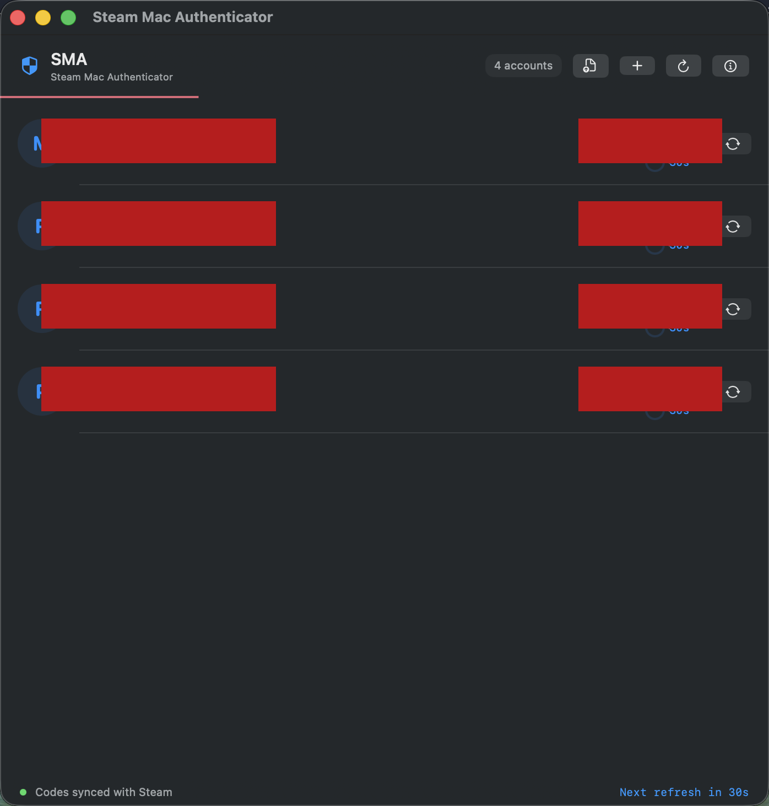

# SMA — Steam Mac Authenticator

A native macOS app for Steam Guard 2FA codes and trade confirmations. Built with SwiftUI, no external dependencies.

**The first fully-featured Steam Desktop Authenticator for Mac.**

<p align="center">
  
</p>

---

## Features

- **Live 2FA codes** — All your Steam accounts with auto-refreshing codes, synced to Steam's server time
- **Trade confirmations** — View, accept, and deny trades with partner details (avatar, name, Steam level)
- **Add Steam Guard** — Set up authenticator on new accounts directly from the app
- **Import maFile** — Drag & drop existing maFiles from SDA, steamguard-cli, or Android backups
- **Auto-fill login** — Username locked + 2FA code auto-filled when signing in to Steam
- **Session persistence** — Login once, stay logged in for months (auto-refresh tokens)
- **Encrypted storage** — Sessions encrypted with AES-256-GCM, random key, owner-only file permissions
- **Zero telemetry** — No analytics, no tracking, no phone-home. Talks to Steam servers only.
- **No dependencies** — Fully self-contained. Nothing to install.

## Install

### Build from source (recommended)

If you handle Steam authenticator secrets, you should verify what you're running. Building from source takes 30 seconds:

```bash
git clone https://github.com/P4tch0/SMA.git
cd SMA
swift build -c release
# Binary at .build/release/SteamGuardMac
```

### Download DMG

DMG releases are built automatically by [GitHub Actions](../../actions) from the source code in this repo — not uploaded manually. You can verify the build yourself.

1. Download `SMA-v1.0.0.dmg` from [Releases](../../releases)
2. Open the DMG and drag **Steam Mac Authenticator** to Applications
3. First launch: right-click the app → **Open** → **Open** (one-time macOS unsigned app prompt)
4. Verify the hash: `shasum -a 256 SMA-v1.0.0.dmg`

## Requirements

- macOS 13 (Ventura) or later
- Apple Silicon or Intel Mac

## How it works

SMA reads Steam Guard secrets from steamguard-cli's maFile format. You can:

1. **Import existing maFiles** — If you have maFiles from SDA or another tool, just drag them into the app
2. **Add new Steam Guard** — Sign in via Steam's web login, and SMA handles the full authenticator setup (phone verification, SMS code, etc.)

All communication goes directly to Steam's servers (`api.steampowered.com`, `steamcommunity.com`). Nothing is sent anywhere else.

## Security

| Feature | Detail |
|---------|--------|
| Encryption | AES-256-GCM with random 256-bit key |
| Key storage | Random key file with 0600 permissions (owner-only) |
| Tokens | Stored in encrypted files, never in plaintext maFiles |
| Network | HTTPS only, tokens in POST body (not URL params) |
| WebView | Non-persistent cookie store, steammobile:// blocked |
| JS injection | User input escaped against XSS (quotes, HTML, backslash) |
| Logging | Debug-only (`#if DEBUG`), no sensitive data logged |
| Thread safety | Time sync state protected by NSLock |
| Dependencies | Zero. No third-party code. No supply chain risk. |

## Privacy

- SMA **never stores your Steam password**. Login happens on Steam's official website via an in-app WebView.
- **No telemetry, no analytics, no crash reporting.** The app never phones home.
- **No auto-updates.** You control when to update.
- All network traffic goes to Steam and nowhere else.
- Full source code available for review.

## Tech Stack

- Swift / SwiftUI
- macOS 13+
- CryptoKit (AES-256-GCM)
- CommonCrypto (HMAC-SHA1 for TOTP)
- WebKit (Steam login WebView)
- Security framework (RSA encryption)
- Zero external packages

## Trust & Transparency

Steam authenticator apps handle sensitive secrets. You should be skeptical — here's why you can trust this one:

| Concern | How SMA addresses it |
|---------|---------------------|
| **"The DMG could contain anything"** | DMG is built by [GitHub Actions](../../actions) from source, not uploaded manually. Build it yourself in 30 seconds. |
| **"No code signing"** | Correct — Apple charges $99/year. Build from source to avoid Gatekeeper entirely. |
| **"Could steal maFiles"** | Read the source. Every network call goes to `steampowered.com` / `steamcommunity.com`. Zero third-party servers. `grep -rn "https://" Sources/` to verify. |
| **"Hidden telemetry?"** | Zero analytics, zero crash reporting, zero phone-home. `grep -rni "telemetry\|analytics\|tracking" Sources/` returns nothing. |
| **"External dependencies?"** | None. `Package.swift` has zero dependencies. Only Apple system frameworks. |

**If you don't trust the binary, build from source.** That's the whole point of open source.

## Supported Formats

| Format | Source |
|--------|--------|
| `.maFile` | SDA / steamguard-cli |
| `Steamguard-*` | Android Steam app (rooted backup) |
| `.json` | Any JSON export with `shared_secret` |

## FAQ

**Q: Will this trigger a 15-day trade hold?**
A: Not if you import an existing maFile. The authenticator stays active on your phone — SMA just clones the codes. Only the "Add Steam Guard" flow (new setup) involves removing/adding.

**Q: Why does macOS say "unidentified developer"?**
A: The app isn't code-signed with an Apple Developer certificate. Right-click → Open → Open bypasses this. It only happens once.

**Q: Is this safe?**
A: The full source code is here. No external dependencies. Security-audited. Read it yourself.

## Contact

- Steam: [Patcho](https://steamcommunity.com/id/Patcho)
- Telegram: [@Yazan](https://t.me/Yazan)
- Twitter: [@PatchoCSGO](https://x.com/PatchoCSGO)

Found a bug or have a suggestion? Open an [issue](../../issues) or reach out on any platform above.

## License

MIT License. See [LICENSE](LICENSE) for details.

---

*Not affiliated with Valve Corporation. Steam is a trademark of Valve Corporation.*
